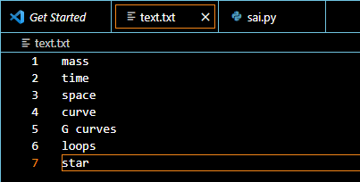
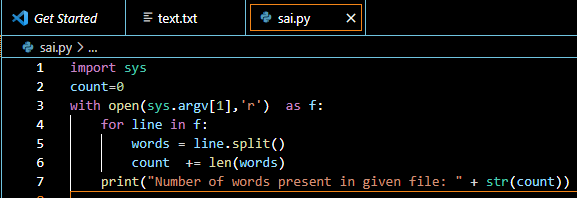
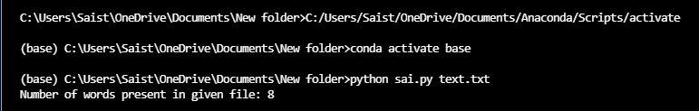

# Command-line-arguments-To-Count-Word
## AIM:
To write a python program for getting the word count from the contents of a file using command line arguments.
## EQUIPEMENTS REQUIRED: 
```
PC
Anaconda - Python 3.7
```
## ALGORITHM: 
### Step 1:
Start python program.
### Step 2: 
 Open the file using command line arguments
### Step 3: 
Using for loop find the word count from the contents of a file.
### Step 4:  
Display the word count from the contents of a file.
### Step 5: 
End the program.
## PROGRAM:
```
#Name:Sai Darshan G
#Reference Number:21003195
import sys
count=0 
with open(sys.argv[1],'r')  as f:
    for line in f:    
        words = line.split()
        count  += len(words) 
    print("Number of words present in given file: " + str(count))
```
### OUTPUT:
```
Text file:
```

```
Python program:
```

```
Output:
```

## RESULT:
Thus the program is written to find the word count from the contents of a file using command line arguments.
